# SANO — Sistema de Asignación de Números de Oficio

> **Reingeniería de software** de un sistema legacy desarrollado en Visual FoxPro (2003) hacia una aplicación web moderna con Spring Boot, MongoDB y Thymeleaf.

---

## Tabla de Contenidos

- [SANO — Sistema de Asignación de Números de Oficio](#sano--sistema-de-asignación-de-números-de-oficio)
  - [Tabla de Contenidos](#tabla-de-contenidos)
  - [Contexto del Proyecto](#contexto-del-proyecto)
  - [Sistema Original (Legacy)](#sistema-original-legacy)
    - [Capturas del Sistema Antiguo](#capturas-del-sistema-antiguo)
  - [Análisis Funcional](#análisis-funcional)
    - [Propósito del Sistema](#propósito-del-sistema)
    - [Entradas del Sistema](#entradas-del-sistema)
    - [Salidas del Sistema](#salidas-del-sistema)
  - [Análisis Técnico del Sistema Legacy](#análisis-técnico-del-sistema-legacy)
    - [Componentes del Sistema Original](#componentes-del-sistema-original)
      - [Formularios (.scx)](#formularios-scx)
      - [Programas (.prg)](#programas-prg)
      - [Tablas (.dbf)](#tablas-dbf)
      - [Reportes (.frx)](#reportes-frx)
    - [Diccionario de Datos Original](#diccionario-de-datos-original)
      - [Tabla: `oficios.dbf`](#tabla-oficiosdbf)
      - [Tabla: `funcionarios.dbf`](#tabla-funcionariosdbf)
  - [Propuesta de Reingeniería (RPE)](#propuesta-de-reingeniería-rpe)
    - [Nuevas Funcionalidades](#nuevas-funcionalidades)
      - [1. Búsqueda avanzada de oficios](#1-búsqueda-avanzada-de-oficios)
      - [2. Edición de registros](#2-edición-de-registros)
      - [3. Eliminación lógica de registros](#3-eliminación-lógica-de-registros)
      - [4. Control de usuarios con roles](#4-control-de-usuarios-con-roles)
      - [5. Seguridad mejorada (login)](#5-seguridad-mejorada-login)
      - [6. Dashboard principal](#6-dashboard-principal)
      - [7. Exportación a PDF y Excel](#7-exportación-a-pdf-y-excel)
      - [8. Filtro por rango de fechas](#8-filtro-por-rango-de-fechas)
      - [9. Gestión de funcionarios (CRUD)](#9-gestión-de-funcionarios-crud)
      - [10. Historial de cambios (Auditoría)](#10-historial-de-cambios-auditoría)
    - [Diagrama de Flujo del Proceso Reingenierizado](#diagrama-de-flujo-del-proceso-reingenierizado)
  - [Arquitectura del Nuevo Sistema](#arquitectura-del-nuevo-sistema)
    - [Stack Tecnológico                         ▼](#stack-tecnológico-------------------------)
    - [Justificación de Tecnologías](#justificación-de-tecnologías)
    - [Estructura del Proyecto](#estructura-del-proyecto)
  - [Capturas del Sistema Nuevo](#capturas-del-sistema-nuevo)
  - [Comparativa: Sistema Antiguo vs. Nuevo](#comparativa-sistema-antiguo-vs-nuevo)
  - [Requisitos Previos](#requisitos-previos)
  - [Instalación y Ejecución](#instalación-y-ejecución)
    - [1. Clonar el repositorio](#1-clonar-el-repositorio)
    - [2. Levantar MongoDB con Docker](#2-levantar-mongodb-con-docker)
    - [3. Ejecutar la aplicación](#3-ejecutar-la-aplicación)
    - [4. Acceder al sistema](#4-acceder-al-sistema)

---

## Contexto del Proyecto

El **Registro Público de la Propiedad y del Comercio — Delegación Cancún** operaba desde 2003 un sistema llamado **SANO** (Sistema de Asignación de Números de Oficio), desarrollado en **Visual FoxPro 6/9**. Su función principal era asignar folios consecutivos a oficios entrantes por año.

Tras más de 20 años de uso, el sistema presentaba serias limitaciones:

| Problema                     | Descripción                                                     |
|------------------------------|-----------------------------------------------------------------|
| **Interfaz obsoleta**        | Formularios de Windows nativos sin diseño responsivo            |
| **Sin seguridad real**       | Contraseña única en texto plano, sin roles ni sesiones          |
| **Sin edición de registros** | Solo se podían insertar datos; no actualizar                    |
| **Falta de escalabilidad**   | Base de datos en archivos `.dbf` locales                        |
| **Sin auditoría**            | No existía registro de quién hizo qué ni cuándo                 |
| **Reportes limitados**       | Solo reportes preformateados de FoxPro, sin exportación digital |

---

## Sistema Original (Legacy)

- **Lenguaje:** Visual FoxPro 6/9
- **Base de datos:** Tablas `.dbf` (archivos locales)
- **Interfaz:** Formularios `.scx` de escritorio
- **Ejecución:** Archivo `sano.exe` ligado a `VFP6R.DLL`

### Capturas del Sistema Antiguo

| Pantalla | Captura |
|----------|---------|
| **Login** — Password en texto plano, sin usuarios | 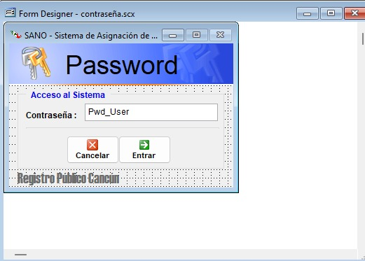 |
| **Menú Principal** — Botones de escritorio | 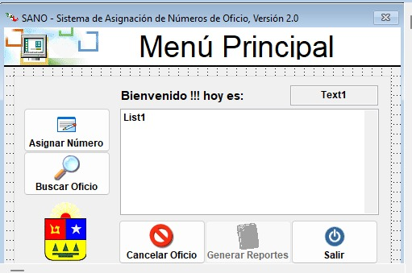 |
| **Asignar Número de Oficio** | 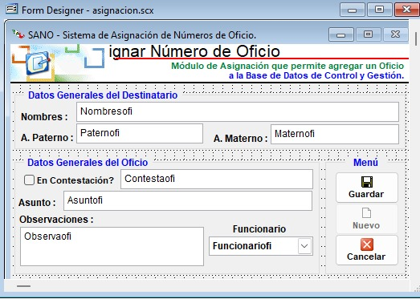 |
| **Buscar Oficio** — Un solo criterio a la vez | 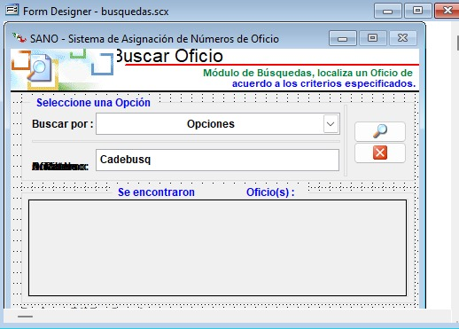 |
| **Cancelar Oficio** | 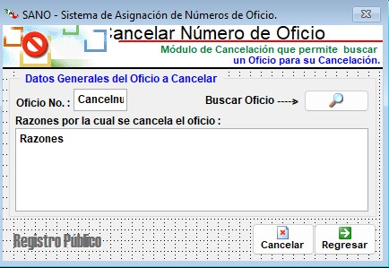 |
| **Validación de Cancelación** | 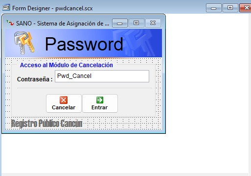 |
| **Reportes** | 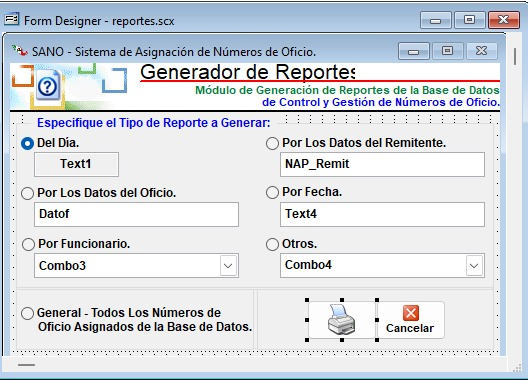 |
| **Información del Sistema** | 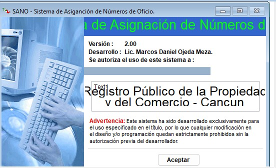 |

---

## Análisis Funcional

### Propósito del Sistema

SANO fue creado para **asignar números de oficio consecutivos** a expedientes del Registro Público de la Propiedad. Resuelve el problema de control y seguimiento de oficios emitidos, vinculando cada oficio a un destinatario y un funcionario responsable.

### Entradas del Sistema

| Dato                | Descripción                                          |
|---------------------|------------------------------------------------------|
| Nombres             | Nombre(s) del destinatario                           |
| Apellido Paterno    | Apellido paterno del destinatario                    |
| Apellido Materno    | Apellido materno del destinatario                    |
| Asunto              | Descripción breve del oficio                         |
| Observaciones       | Notas adicionales                                    |
| En Contestación     | Si el oficio es respuesta a otro                     |
| Contesta (oficio)   | Referencia al oficio que contesta                    |
| Funcionario         | Empleado responsable (seleccionado de un catálogo)   |

### Salidas del Sistema

- **Número de oficio** asignado automáticamente (consecutivo por año)
- **Registro almacenado** en base de datos con fecha y hora
- **Reportes** diarios, por asunto, por respuesta y específicos

---

## Análisis Técnico del Sistema Legacy

### Componentes del Sistema Original

#### Formularios (.scx)

| Archivo            | Función                        |
|--------------------|--------------------------------|
| asignacion.scx     | Asignación de folios           |
| busquedas.scx      | Búsqueda de registros          |
| cancelacion.scx    | Cancelación de registros       |
| contraseña.scx     | Inicio de sesión               |
| info.scx           | Información del sistema        |
| menu_principal.scx | Menú principal                 |
| presentacion.scx   | Pantalla de bienvenida         |
| pwdcancel.scx      | Validación para cancelar       |
| reportes.scx       | Interfaz para generar reportes |

#### Programas (.prg)

| Archivo            | Función                          |
|--------------------|----------------------------------|
| acceso.prg         | Control de acceso                |
| asignar.prg        | Lógica de asignación de folios   |
| buscar.prg         | Búsqueda de datos                |
| cancelaciones.prg  | Gestión de cancelaciones         |
| cancelar.prg       | Cancelar registros               |
| chkdel.prg         | Validación de eliminación        |
| genera_rep.prg     | Generación de reportes           |
| inicio.prg         | Inicialización del sistema       |
| menuprin.prg       | Control del menú                 |
| presentacion1.prg  | Pantalla inicial                 |
| qry_asunto.prg     | Consulta por asunto              |
| qry_contesta.prg   | Consulta de respuestas           |
| qry_empleado.prg   | Consulta de empleados            |
| qry_materno.prg    | Consulta por apellido materno    |
| qry_nombres.prg    | Consulta por nombre              |
| qry_paterno.prg    | Consulta por apellido paterno    |

#### Tablas (.dbf)

| Archivo          | Función                                   |
|------------------|-------------------------------------------|
| funcionarios.dbf | Datos de empleados/funcionarios           |
| oficios.dbf      | Registros de oficios                      |
| sano_ref.dbf     | Datos de referencia interna del sistema   |
| FOXUSER.dbf      | Configuración interna de FoxPro           |

#### Reportes (.frx)

| Archivo              | Función              |
|----------------------|----------------------|
| reporte diario.frx   | Reporte diario       |
| reporte_asunto.frx   | Reporte por asunto   |
| reporte_contesta.frx | Reporte de respuestas|
| reporte_nap.frx      | Reporte específico   |

### Diccionario de Datos Original

#### Tabla: `oficios.dbf`

| Campo       | Tipo      | Descripción                 |
|-------------|-----------|------------------------------|
| oficio      | Numeric   | Número de oficio (PK)        |
| paterno     | Character | Apellido paterno             |
| materno     | Character | Apellido materno             |
| nombres     | Character | Nombre(s) del destinatario   |
| contesta    | Character | Oficio que contesta          |
| asunto      | Character | Asunto del oficio            |
| observacio  | Character | Observaciones                |
| empleado    | Numeric   | FK al funcionario asignado   |
| fecha       | Date      | Fecha de registro            |
| hora        | Character | Hora de registro             |

#### Tabla: `funcionarios.dbf`

| Campo  | Tipo      | Descripción                  |
|--------|-----------|-------------------------------|
| nombre | Character | Nombre del funcionario        |
| puesto | Character | Puesto o cargo del funcionario|

---

## Propuesta de Reingeniería (RPE)

**Objetivo:** Modernizar el sistema legacy mejorando funcionalidad, usabilidad, seguridad y control de la información.

### Nuevas Funcionalidades

#### 1. Búsqueda avanzada de oficios
Permite buscar registros por **múltiples criterios simultáneos**: nombre, apellidos, asunto, funcionario, tipo (original/en contestación), y rango de fechas. El sistema original solo permitía buscar por un criterio a la vez.

#### 2. Edición de registros
Permite **modificar registros existentes** directamente desde la tabla de resultados mediante un modal de edición. En el sistema original solo se podían insertar datos, nunca actualizar.

#### 3. Eliminación lógica de registros
En lugar de borrar datos permanentemente, los oficios se marcan como **"eliminados"** con motivo y registro del responsable. Requiere confirmación con contraseña. Esto preserva la información para auditoría.

#### 4. Control de usuarios con roles
Sistema completo de **usuarios con autenticación** y dos roles:
- **ADMIN** — Acceso total: gestión de usuarios, funcionarios, oficios y reportes
- **EMPLEADO** — Acceso limitado a captura y consulta

#### 5. Seguridad mejorada (login)
- Contraseñas **cifradas con BCrypt**
- **Sesiones HTTP** con Spring Security
- Protección **CSRF** en formularios
- El sistema original usaba una contraseña en texto plano compartida

#### 6. Dashboard principal
Pantalla de inicio con:
- **Filtros avanzados** para búsqueda rápida
- **Tabla paginada** de oficios con ordenamiento
- **Chips** indicadores de filtros activos
- Conteo total de registros

#### 7. Exportación a PDF y Excel
Permite exportar reportes filtrados en formato **PDF** (OpenPDF) y **Excel** (Apache POI), facilitando el uso externo de la información.

#### 8. Filtro por rango de fechas
Permite acotar resultados seleccionando un **rango de fechas** (desde/hasta), útil para consultas por período específico.

#### 9. Gestión de funcionarios (CRUD)
Módulo completo para **alta, baja, edición y activación/desactivación** de funcionarios, con estadísticas en tiempo real (total, activos, inactivos).

#### 10. Historial de cambios (Auditoría)
Registro automático de:
- **Quién** realizó la acción (usuario)
- **Qué** se hizo (crear, editar, eliminar)
- **Sobre qué entidad** (oficio, funcionario, usuario)
- **Cuándo** (fecha y hora)

### Diagrama de Flujo del Proceso Reingenierizado

```
                            ┌─────────┐
                            │  Inicio │
                            └────┬────┘
                                 │
                                 ▼
                       ┌─────────────────┐
                       │ Login de usuario │
                       └────────┬────────┘
                                │
                    ┌───────────┴───────────┐
                    │ ¿Credenciales válidas?│
                    └───────────┬───────────┘
                           ╱         ╲
                         NO           SÍ
                          │            │
                          ▼            ▼
                   ┌──────────┐  ┌──────────────┐
                   │  Error   │  │ Menú (sidebar)│
                   └──────────┘  └──────┬───────┘
                                        │
               ┌────────┬───────┬───────┼───────┬───────────┐
               ▼        ▼       ▼       ▼       ▼           ▼
          ┌─────────┐┌──────┐┌──────┐┌──────┐┌────────┐┌────────┐
          │Dashboard││Asig- ││Buscar││Repor-││Funcio- ││Usuarios│
          │  (Home) ││nar   ││Oficio││tes   ││narios  ││(Admin) │
          └────┬────┘└──┬───┘└──┬───┘└──┬───┘└───┬────┘└────────┘
               │        │       │       │        │
               │        ▼       ▼       ▼        ▼
               │   ┌────────┐┌──────┐┌──────┐┌────────┐
               │   │Captura ││Filtros││PDF / ││ CRUD   │
               │   │datos   ││múlti-││Excel ││ Alta/  │
               │   └───┬────┘│ples  │└──────┘│ Baja   │
               │       │     └──┬───┘        └────────┘
               │       ▼       │
               │  ┌──────────┐ │
               │  │Validación│ │
               │  └────┬─────┘ ▼
               │       │  ┌──────────────┐
               │       │  │Editar/Eliminar│
               │       ▼  └──────┬───────┘
               │  ┌──────────┐   │
               │  │Guardar BD│   │
               │  └────┬─────┘   │
               │       │         │
               │       ▼         ▼
               │  ┌───────────────────┐
               └─▶│  Registro en log  │
                  │   de auditoría    │
                  └───────────────────┘
```

---

## Arquitectura del Nuevo Sistema

El sistema fue rediseñado siguiendo el patrón **MVC (Modelo–Vista–Controlador)** como aplicación web, reemplazando la arquitectura monolítica de escritorio de Visual FoxPro.

```
┌──────────────────────────────────────────────────────────────┐
│                     NAVEGADOR WEB                            │
│              (HTML + CSS + JavaScript)                        │
└─────────────────────────┬────────────────────────────────────┘
                          │ HTTP / REST
┌─────────────────────────▼────────────────────────────────────┐
│                   SPRING BOOT 4.0.5                           │
│  ┌─────────────┐  ┌──────────────┐  ┌──────────────────┐    │
│  │ Controllers  │  │   Services   │  │   Repositories   │    │
│  │ (Vista/API)  │──│   (Lógica)   │──│  (Spring Data)   │    │
│  └─────────────┘  └──────────────┘  └────────┬─────────┘    │
│  ┌─────────────┐  ┌──────────────┐           │              │
│  │  Thymeleaf  │  │   Security   │           │              │
│  │ (Templates) │  │  (BCrypt +   │           │              │
│  │             │  │   Sesiones)  │           │              │
│  └─────────────┘  └──────────────┘           │              │
└──────────────────────────────────────────────┼──────────────┘
                                               │
                          ┌────────────────────▼──────────────┐
                          │          MONGODB                   │
                          │  ┌──────────┐  ┌──────────────┐   │
                          │  │ oficios  │  │ funcionarios  │   │
                          │  ├──────────┤  ├──────────────┤   │
                          │  │ usuarios │  │  audit_logs  │   │
                          │  └──────────┘  └──────────────┘   │
                          └───────────────────────────────────┘
```

### Stack Tecnológico                         ▼
                       ┌

| Componente       | Tecnología                               |
|------------------|------------------------------------------|
| **Backend**      | Java 17 + Spring Boot 4.0.5              |
| **Base de Datos**| MongoDB                                  |
| **Seguridad**    | Spring Security + BCrypt                 |
| **Frontend**     | Thymeleaf + HTML5 + CSS3 + JavaScript ES6|
| **Reportes**     | OpenPDF (PDF) + Apache POI (Excel)       |
| **Contenedores** | Docker Compose (MongoDB)                 |
| **Build**        | Maven                                    |

### Justificación de Tecnologías

- **Spring Boot** — Framework robusto con patrón MVC, inyección de dependencias y ecosistema maduro para aplicaciones web empresariales.
- **MongoDB** — Base de datos NoSQL flexible que permite evolucionar el esquema sin migraciones complejas; ideal para documentos con campos variables como los oficios.
- **Spring Security** — Gestión completa de autenticación y autorización con cifrado BCrypt, protección CSRF y manejo de sesiones. Resuelve la grave debilidad del sistema original (contraseña en texto plano).
- **Thymeleaf** — Motor de plantillas integrado con Spring que genera HTML del lado del servidor, manteniendo la simplicidad sin requerir un framework SPA separado.
- **Docker Compose** — Permite levantar la base de datos MongoDB con un solo comando, sin necesidad de instalación manual.
- **OpenPDF + Apache POI** — Generación de reportes en formatos estándar (PDF/Excel) que reemplazan los reportes `.frx` de FoxPro.

### Estructura del Proyecto

```
src/main/java/com/sano/sano/
├── SanoApplication.java              # Punto de entrada
├── config/
│   ├── SecurityConfig.java           # Configuración Spring Security
│   ├── DataSeeder.java               # Datos iniciales (usuarios por defecto)
│   └── GlobalModelAttributes.java    # Atributos globales para Thymeleaf
├── controller/
│   ├── AuthController.java           # Login
│   ├── DashboardController.java      # Página principal
│   ├── OficioController.java         # Formulario de asignación
│   ├── BuscarOficioController.java   # Interfaz de búsqueda
│   ├── OficioApiController.java      # API REST (CRUD oficios)
│   ├── FuncionarioController.java    # Gestión de funcionarios
│   ├── UsuarioController.java        # Gestión de usuarios
│   ├── LogsController.java           # Historial de auditoría
│   └── ReporteController.java        # Generación de reportes
├── dto/
│   ├── OficioDto.java                # Respuesta de oficio
│   ├── OficioSaveDto.java            # Creación de oficio
│   ├── OficioUpdateDto.java          # Actualización de oficio
│   ├── OficioFilterDto.java          # Filtros de búsqueda
│   ├── OficioDeleteRequestDto.java   # Solicitud de eliminación
│   └── PageResultDto.java            # Paginación genérica
├── models/
│   ├── Oficio.java                   # Documento MongoDB: oficios
│   ├── Usuario.java                  # Documento MongoDB: usuarios
│   ├── Funcionario.java              # Documento MongoDB: funcionarios
│   └── AuditLog.java                 # Documento MongoDB: auditoría
├── repositorios/
│   ├── OficioRepository.java
│   ├── UsuarioRepository.java
│   ├── FuncionarioRepository.java
│   └── AuditLogRepository.java
└── services/
    ├── OficioService.java
    ├── UsuarioService.java
    ├── FuncionarioService.java
    ├── AuditLogService.java
    ├── ReporteService.java
    └── imp/
        ├── OficioServiceImp.java
        ├── UsuarioServiceImp.java
        ├── FuncionarioServiceImp.java
        ├── AuditLogServiceImp.java
        ├── ReporteServiceImp.java
        └── CustomUserDetailsService.java
```

```
src/main/resources/
├── application.properties
├── templates/
│   ├── layout.html                 # Plantilla maestra con sidebar
│   ├── login.html                  # Página de login
│   ├── index.html                  # Dashboard principal
│   ├── asignar.html                # Formulario de asignación
│   ├── buscar-oficio.html          # Búsqueda avanzada
│   ├── funcionarios.html           # Gestión de funcionarios
│   ├── usuarios.html               # Gestión de usuarios
│   ├── logs.html                   # Historial de auditoría
│   ├── reportes.html               # Generación de reportes
│   ├── sistema-info.html           # Info del sistema
│   └── fragments/
│       ├── sidebar.html            # Barra de navegación lateral
│       ├── modal-editar-oficio.html
│       └── modal-eliminar-oficio.html
└── static/
    ├── css/  (10 archivos)         # Estilos organizados por módulo
    └── js/   (7 archivos)          # Lógica de interacción por módulo
```

---

## Capturas del Sistema Nuevo

| Pantalla | Captura |
|----------|---------|
| **Login** — Diseño moderno con panel dual, cifrado BCrypt | 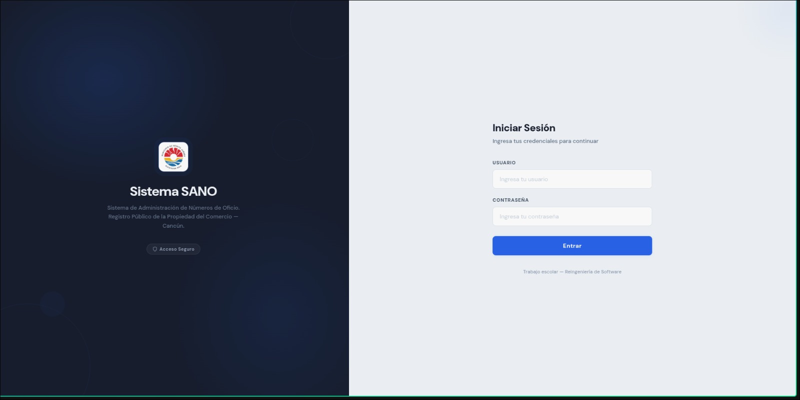 |
| **Dashboard / Home (Admin)** — Filtros avanzados, tabla paginada, chips de filtros | 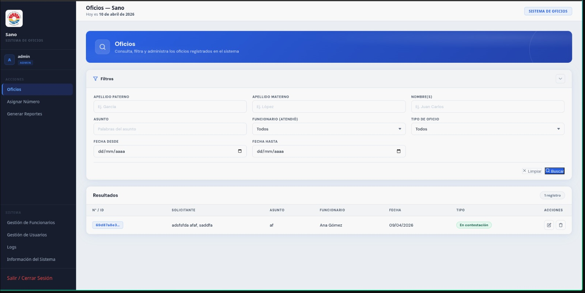 |
| **Dashboard / Home (Empleado)** — Vista limitada según rol | 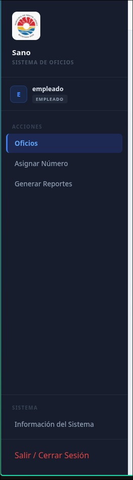 |
| **Asignar Número de Oficio** — Formulario validado con selección de funcionario | 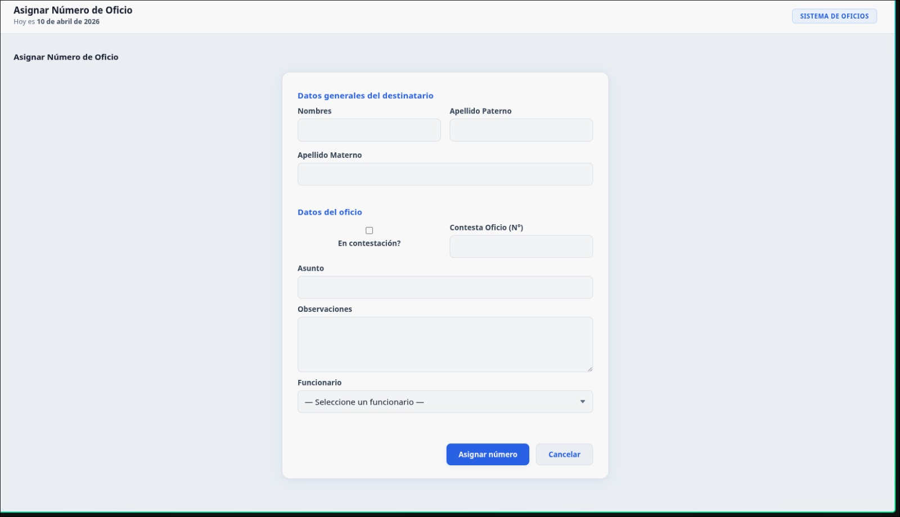 |
| **Buscar Oficio** — Múltiples filtros simultáneos, paginación, acciones rápidas | 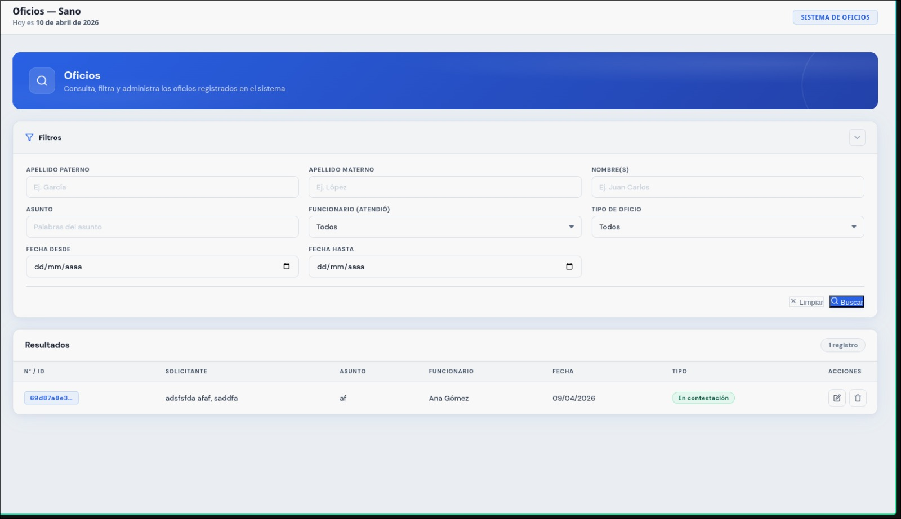 |
| **Editar Oficio (Modal)** — Edición inline desde resultados de búsqueda | 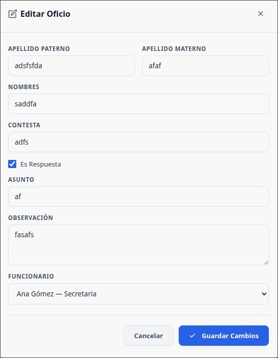 |
| **Eliminar Oficio (Modal)** — Eliminación lógica con motivo y contraseña | 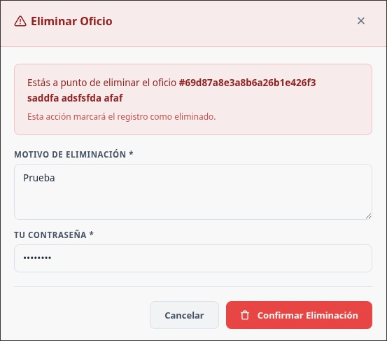 |
| **Gestión de Funcionarios** — CRUD completo con estadísticas | 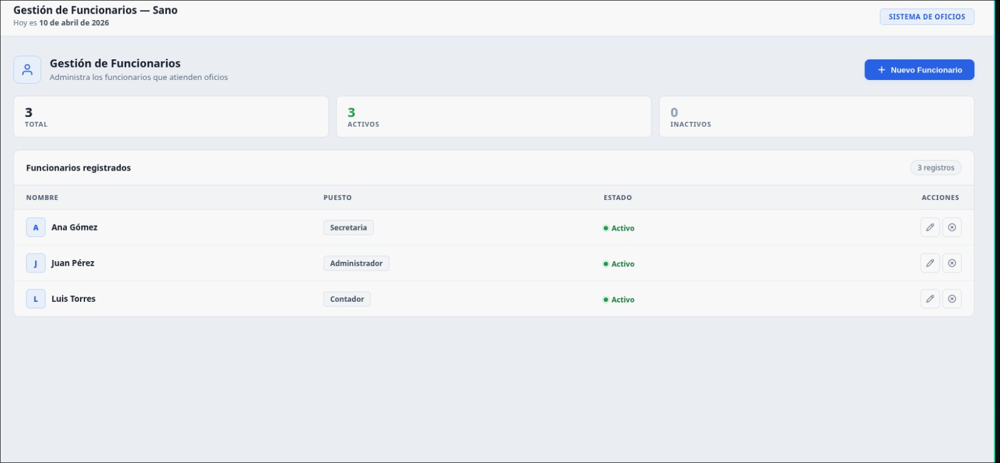 |
| **Gestión de Usuarios** — Roles ADMIN/EMPLEADO, activación/desactivación | 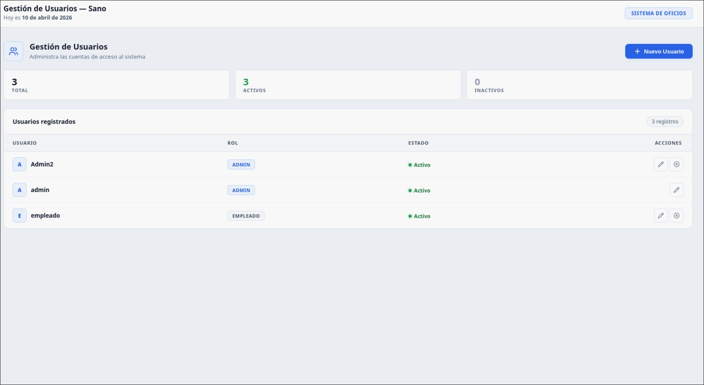 |
| **Reportes** — Filtros y exportación a PDF/Excel | 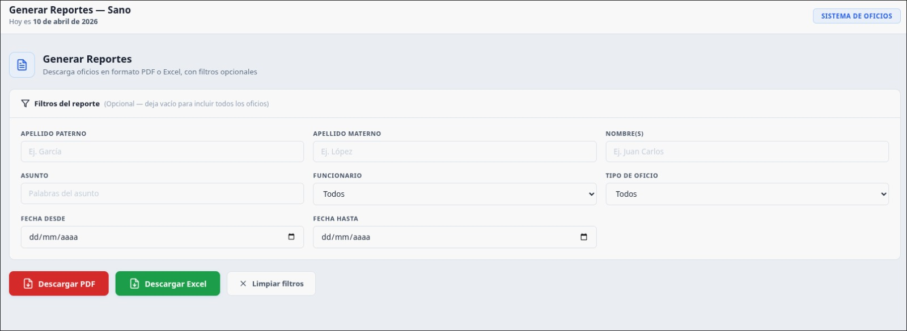 |
| **Historial de Auditoría (Logs)** — Registro de todas las acciones del sistema | 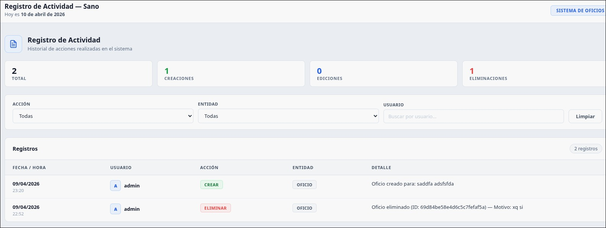 |
| **Información del Sistema** | 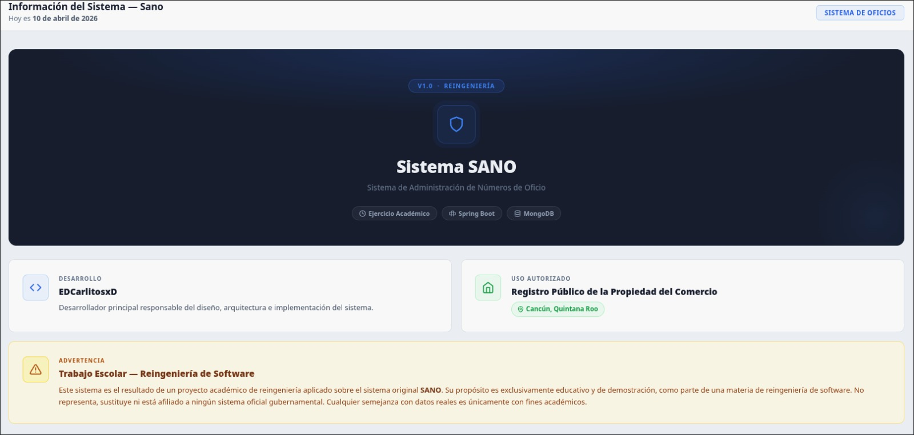 |

---

## Comparativa: Sistema Antiguo vs. Nuevo

| Aspecto              | Sistema Legacy (FoxPro)            | Sistema Nuevo (Spring Boot)                 |
|----------------------|------------------------------------|---------------------------------------------|
| **Plataforma**       | Escritorio (Windows)               | Web (cualquier navegador)                   |
| **Lenguaje**         | Visual FoxPro 6                    | Java 17                                     |
| **Base de datos**    | Archivos `.dbf` locales            | MongoDB (Docker)                            |
| **Seguridad**        | Contraseña en texto plano          | BCrypt + Spring Security + CSRF + roles     |
| **Usuarios**         | Sin sistema de usuarios            | Roles ADMIN / EMPLEADO                      |
| **Edición**          | No disponible                      | Edición completa vía modal                  |
| **Eliminación**      | Borrado físico directo             | Eliminación lógica con motivo y auditoría   |
| **Búsqueda**         | Un criterio a la vez               | Múltiples filtros simultáneos + paginación  |
| **Reportes**         | Formatos `.frx` de FoxPro          | PDF y Excel exportables                     |
| **Auditoría**        | Inexistente                        | Log completo de acciones                    |
| **Interfaz**         | Formularios Windows nativos        | UI web moderna y responsiva                 |
| **Mantenimiento**    | Requiere FoxPro instalado          | Maven + Docker, código fuente versionable   |

---

## Requisitos Previos

- **Java 17** o superior
- **Maven 3.8+**
- **Docker** y **Docker Compose** (para MongoDB)

## Instalación y Ejecución

### 1. Clonar el repositorio

```bash
git clone <url-del-repositorio>
cd reingenieria-sano
```

### 2. Levantar MongoDB con Docker

```bash
docker compose up -d
```

Esto inicia un contenedor MongoDB en el puerto `27017` con las credenciales configuradas.

### 3. Ejecutar la aplicación

```bash
./mvnw spring-boot:run
```

### 4. Acceder al sistema

Abre el navegador en **http://localhost:8080**

**Usuarios por defecto** (creados por el `DataSeeder`):

| Usuario   | Contraseña | Rol       |
|-----------|------------|-----------|
| `admin`   | `admin`    | ADMIN     |
| `empleado`| `empleado` | EMPLEADO  |

> **Nota:** Cambia las contraseñas por defecto en un entorno de producción.


sudo timedatectl set-time "2027-04-15 12:00:00"
sudo timedatectl set-ntp false